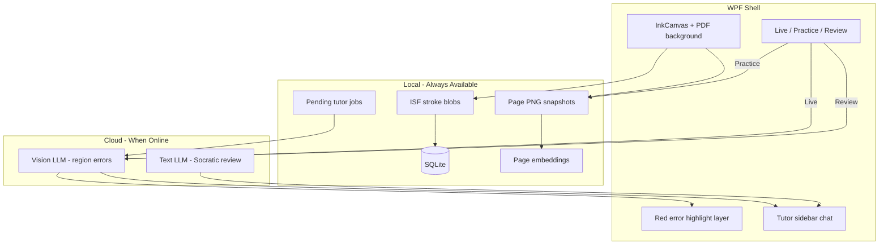

# NoteTaker (Ellery)

A pen-first note-taking app for the Surface Pro 11 with an AI tutor that marks up your
handwritten work. Notes are always local and always available; the tutor is the only part
that needs the internet. Built on WPF/.NET 8, styled as "Ellery": night chrome, charcoal
writing ground, cream ink, amber accent.

This file is the single source of truth for the project — product intent, architecture,
setup, the Phase 1 decision record, every fix landed so far, and known limitations. It
replaces `handoff.md`, `project_overview.md`, and `docs/phase1-gate.md`, which no longer
exist as separate files; everything they contained lives below. The `prompts/*.md` files
are the live, embedded system prompts `NoteTaker.AI` compiles into the app at build time.
**They are not reproduced here.** This file used to carry a full copy of each one, and the
copy was stale within a fortnight — read `prompts/*.md` directly.

## What it does

- **Write** with the pen on a fixed A4 page. Strokes persist as Windows Ink Serialized
  Format (ISF) blobs in SQLite, auto-saved a second and a half after you stop writing.
- **Annotate PDFs** by attaching a page as the background and writing over it. Ink stays
  aligned at every zoom level because both live in the same logical coordinate space.
- **Ask why** in the sidebar. The tutor reads the page, finds the first genuinely wrong
  step, and asks about it — it only shows the corrected step once you have genuinely tried
  a few times. This is the main way the tutor is used.
- **Mark work without being taught** with Shift+R: the page is judged, one row is banked for
  Review, and nothing is written back. About a fifth the cost of a chat turn.
- **See where you stand** in Review: confidence per skill for the current topic, built from
  the tutor's own per-turn verdicts, and a written report once there is enough behind it.
- **Get corrected on the page** by a vision model returning normalized regions, drawn as a
  red underline on the offending ink. **Currently switched off** — see Cost control.
- **Practice silently.** Practice mode makes zero network calls, so an exam rehearsal is
  never interrupted by a hint.
- **Find things later** with keyword search over recognized handwriting and visual
  similarity search over whole pages.

## Goals

- Pen-first notes with OneNote-class latency on Surface Pro 11
- An AI tutor that flags mistakes on both conceptual notes and problem-set work
- Three tutor modes: **Live**, **Practice** (no spoilers), **Review** (Socratic + error-pattern summary)
- Hybrid feedback: a red underline on the wrong ink, plus a sidebar chat for the explanation
- Offline-first note-taking; the tutor runs when online and queues when not
- Local search over pen-only STEM notes, accepting that formula search will be imperfect
- Single device, no sync, roughly $1–5/month of LLM cost via mode-aware budgeting
- Personal sideload, no Store or signing

## Requirements

- Windows 11 on ARM64 or x64
- [.NET 8 SDK](https://dotnet.microsoft.com/download/dotnet/8.0)
- An API key for a vision model and (optionally) a separate chat model

## Build and run

```powershell
dotnet build
dotnet run --project src\NoteTaker.App
```

On Surface / ARM64 devices, pass the platform explicitly — pointer and tablet input often
misbehave otherwise:

```powershell
dotnet run --project src\NoteTaker.App\NoteTaker.App.csproj -c Debug -p:Platform=ARM64
```

Run the gate checks at any time (see [Self-test expectations](#self-test-expectations)):

```powershell
dotnet run --project tools\NoteTaker.SelfTest
```

## First-run setup

1. Open **Tools → Settings**.
2. Vision defaults to **Gemini** / `gemini-3.1-flash-lite` — paste a [Gemini API key](https://aistudio.google.com/apikey).
3. Chat defaults to **OpenAiCompatible** / `gpt-5.6-luna` — paste an [OpenAI API key](https://platform.openai.com/api-keys).
   Switching Chat's provider to **Gemini** reuses the same Gemini key already pasted for
   Vision — one credential, both roles.
4. Keys go into Windows Credential Manager, never into the notes database or a settings file.
5. Set your daily budget. The default is 25 cents.

Without a key the app is a fully functional offline note-taker; only the tutor is idle.

| Role | Default provider | Default model |
|------|------------------|---------------|
| Vision (Live/Review) | Gemini | `gemini-3.1-flash-lite` |
| Chat (sidebar) | OpenAiCompatible | `gpt-5.6-luna` |

## Tech stack

| Layer | Choice | Rationale |
|---|---|---|
| App | **WPF / C# / .NET 8** | `InkCanvas` on the Windows Ink Services Platform; wet ink renders on its own thread |
| Storage | **SQLite** (`Microsoft.Data.Sqlite`) | Notebooks, ISF strokes, embeddings, tutor state |
| PDF | **PDFtoImage** (PDFium) + ink overlay | Renders problem-set pages as a background; verified on ARM64 |
| Graphing | **Built-in plotter** | Expression parser plus WPF vector rendering, stamped into the page |
| Code cells | **Local Python subprocess** | Captured stdout with a hard timeout |
| Page similarity | **Built-in ink-density descriptor**, or **ONNX CLIP** when configured | Works offline on day one; upgrades if you supply a model |
| Keyword fallback | **Windows ink recognition** (WinRT) | Indexes any legible prose; a supplement, not the primary path |
| Tutor (live checks) | **Gemini 3.1 Flash-Lite**, or any OpenAI-compatible vision model | Cheap, fast region feedback |
| Tutor (review chat) | **GPT-5.6 Luna**, or any configured chat model (including Gemini, via its OpenAI-compatible endpoint) | Short Socratic explanations on demand |
| Chat rendering | **WebView2 + KaTeX**, bundled locally | Real typeset math (fractions, radicals, matrices) in replies, not Unicode approximations; no CDN, works offline |
| Secrets | **Windows Credential Manager** | API keys never touch SQLite or settings.json |

## Architecture



All three modes are enforced in `TutorCoordinator` in `NoteTaker.Core`, not in the UI, so
no code path can leak a hint during a Practice session. The self-test asserts this.

### Solution layout

```
note-taking/
├── src/
│   ├── NoteTaker.App/       WPF shell, ink surface, dialogs, rendering, export
│   ├── NoteTaker.Core/      Models, tutor orchestration, budget, search, expressions
│   ├── NoteTaker.Data/      SQLite schema and repositories
│   └── NoteTaker.AI/        LLM transports, prompt loading, response parsing
├── prompts/                 Versioned system prompts, embedded into NoteTaker.AI at build
└── tools/
    └── NoteTaker.SelfTest/  Runnable offline gate checks (89, all passing)
```

| Project | Role |
|---------|------|
| `src/NoteTaker.App` | WPF UI, ink surface, snapshots, Ellery chrome |
| `src/NoteTaker.Core` | Models, tutor coordinator, geometry contracts |
| `src/NoteTaker.Data` | SQLite repos |
| `src/NoteTaker.AI` | `TutorClient`, transports, prompt embedding |
| `tools/NoteTaker.SelfTest` | Offline behavioural gate (89 tests) |
| `prompts/*.md` | Embedded system prompts (`PromptLibrary`) |

### Tutor code map

| Concern | Where |
|---------|--------|
| When to call AI | `TutorCoordinator` |
| Dedupe boxes | `FindingDeduper` |
| Ink in region? | `IPageSnapshotProvider.RegionContainsInkAsync` + `InkHitTolerance` |
| LLM calls | `TutorClient` + `Transport/*` |
| UI mode / chat / highlights | `MainWindow.xaml(.cs)` |
| Persist feedback / threads | `TutorRepository` |
| Which finding the chat is anchored to | `ChatAnchorResolver` (`NoteTaker.App/Services`) |
| Chat rendering (WebView2 + KaTeX) | `InitializeChatWebViewAsync`/`AppendChatMessageAsync` (`MainWindow.xaml.cs`), assets in `Assets/chat/` |
| Verdict tag parse + strip | `SkillVerdictParser`; mid-stream suppression in `TutorClient.IndexOfTagStart` |
| Attempts, not turns | `SkillAttempts` (45-minute gap starts a new problem) |
| Skill scoring | `SkillConfidence` (independence, recency, decay, trend) |
| When a report is worth writing | `SkillReportGate` |
| When the hint ladder resets | `HintLadder` |
| What today may spend | `MonthlyBudget` (pure) applied by `TutorBudget` |
| When a budget day/month begins | `BudgetDay` (Pacific) + `ServerCorrectedClock` |
| The usage screen's arithmetic | `UsageOutlook` (pure), drawn by `Views/UsageBoard` |
| How much history to resend | `ChatHistoryWindow` (not a UI window) |
| Landing screen, subjects, syllabus | `Views/HomePanel`, `SyllabusParser`, `SyllabusPdfReader` |

`TutorMode` enum: `Live = 0`, `Practice = 1`, `Review = 2`. SQLite `Page.TutorMode` DEFAULT
0 = Live. **Existing pages** keep whatever was saved (may still be Practice from earlier
debugging — switch the radio to Live).

## Tutor modes

| Mode | Network activity | What you see |
|---|---|---|
| Live | The sidebar tutor, when you ask it something | A conversation; no marks on the page |
| Practice | None at all | Nothing — total silence |
| Review | None until you press the report button | Confidence per skill, and a written report on request |

**The page-scanning half of Live and Review is switched off** (`VisionEnabled = false`), so no
red underlines appear and Review runs no scan. The two sections below describe that machinery,
which still exists and still works — see Cost control for why it is off. What Live means in
practice today is "the tutor is available in the sidebar".

Practice mode is enforced in `TutorCoordinator`, not in the UI, so no code path can leak a
hint during a session. The self-test asserts this.

Important knobs (`AppSettings` / `TutorOptions`):

- `LiveDebounceSeconds` ≈ **2.5**
- `MinLiveIntervalSeconds` ≈ **20** (later mistakes need a pause or "Check the page")
- `RevealAfterTurns` ≥ **4** (Socratic unlock; session-local turn counter, not old thread length)
- `MaxLiveCallsPerHour` ≈ **12**
- `MonthlyCostCapUsd` default **$8.00**, redistributed daily — see Cost control

### Live mode

- Triggered by a 2.5 s debounce after the last stroke, with a minimum gap between checks
  and an hourly ceiling. All three are configurable.
- Sends the page PNG plus the bounding box of the strokes you just wrote (the "focus"), so
  the model weights its attention on fresh work instead of re-flagging settled ink.
  Concretely: ink pause → `NotifyInkChanged` → debounce → `RunLiveCheckAsync`. Focus is the
  **latest stroke region** (capped ~0.42×0.28 of the page), not an unbounded page union.
- The model returns structured JSON: `regions[]` of `{ x, y, w, h, severity, label }` in
  normalized 0–1 coordinates, plus a one-line summary that is a hint, never a solution.
- A translucent red box and a solid red underline appear over the flagged ink. Findings are
  also listed in the sidebar; selecting one scrolls to it and opens its thread.
- The response parser tolerates code fences, prose wrappers, alternate key names, zero-area
  boxes, and coordinates on Gemini's native 0–1000 box scale (rescaled rather than clamped
  into a dead corner box), so a chatty or scale-confused model degrades to fewer findings
  rather than an error.
- `FindingDeduper` collapses overlapping boxes (IoU + IoMin) and, separately, boxes on the
  same line with an identical label (see [Fixes landed](#fixes-landed-do-not-regress) #17).
- Findings are accepted with a **loose** ink hit-test; pruned/dismissed with a **strict** one.
- Live **merges** into existing marks rather than replacing the whole page: settled marks
  elsewhere are left alone; anything inside the current focus window is authoritative — if
  the fresh scan doesn't re-flag it, it's treated as resolved, not just skipped (see fix #10).

### Practice mode

- Zero API calls, enforced at the coordinator.
- Strokes still save normally; nothing is uploaded.
- Existing highlights are hidden the moment you switch in, so a previous session's marks
  cannot give anything away.

### Review mode

Review no longer scans the page. It reads what the tutor has already judged.

**Where the data comes from.** The chat tutor ends every reply with a tag the student never
sees, on its own final line:

```
⟦u substitution|wrong|picked u = x^2 not the exponent⟧
```

`⟦⟧` because those brackets cannot collide with LaTeX, `$`, or ordinary prose. The tag is
stripped in three places — before display, before the message is stored, and mid-stream — the
second because a tag left in a stored reply is resent, and paid for, on every later turn.
Each tag becomes one `SkillEvent` row. Shift+R banks a row the same way without any tutoring.

**Attempts, not turns.** A problem that took nine replies is one attempt, not nine.
`SkillAttempts` segments events on a 45-minute gap. Fifteen rows from two problems is two data
points, and an early version that counted turns showed three confident bars built on nothing.

**What is scored.** Working with a tutor, every problem ends right eventually, so correctness
carries almost no information. What matters is how much help it took:

- **independence** = `1 / (1 + corrections)` — unaided is 1
- **recency weighting** (0.7 falloff) so last week matters less than yesterday
- **decay toward neutral** on a 30-day half-life, so an untouched skill stops asserting itself
- **trend** from comparing the earlier half of the attempts against the later half

**The panel.** Confidence meters are arithmetic over rows already on disk, so they always show
and always cost nothing. Above them sits the progress toward a written report: two bars, one
for problems and one for skills, each owning half the width and clamped so neither can spill
into the other's half — the gate needs both, and a single averaged bar could sit near full
while one condition was at zero.

**The report** is the only part of Review that spends, so it is a button, never a side effect
of opening the panel. It walks each skill weakest-first, grounded in the counts, and replaces
the meters once written — the bars and the prose would otherwise say the same thing twice.
`SkillReportGate` decides whether the numbers have moved enough for an automatic rewrite to be
worth it; pressing the button bypasses that, because you have already decided.

**Gates:** 5 attempts across 3 distinct skills before a report is offered.

### Chat rendering

The chat panel is a `WebView2` control (`ChatWebView` in `MainWindow.xaml`), not a plain WPF
`ItemsControl` — replies can carry real typeset math (stacked fractions, radicals,
matrices), not just Unicode lookalikes. `socratic.md` tells the model to wrap math in
`$...$`/`$$...$$`; KaTeX renders it.

- **Fully offline, no CDN.** KaTeX's JS/CSS/fonts are bundled under `Assets/chat/katex/` and
  copied to the output directory as `Content` (not `Resource` — WebView2 needs an actual
  folder on disk to map, not an embedded pack resource). `InitializeChatWebViewAsync` maps
  that folder to a virtual host (`SetVirtualHostNameToFolderMapping`) and navigates there —
  nothing about rendering math depends on a network connection.
- **Safe by construction, not by sanitizing.** `AppendChatMessageAsync` passes each
  message's text to the page as a JSON-encoded string argument to `addMessage(role, text)`
  (`Assets/chat/chat.js`), which sets it via `element.textContent` — never `innerHTML`. The
  browser escapes everything in `textContent`; KaTeX's `renderMathInElement` then walks the
  already-safe text nodes looking for `$...$` delimiters. Model or student text can never
  break out of that assignment and execute as script or markup — there's no HTML string
  built in C# for it to break out of in the first place.
- **Theming**: `Assets/chat/chat.css` transcribes the same token values as
  `Theme/Tokens.xaml` (Peri300 text, the `#1AA9B7DE` user-bubble wash, etc.) so the panel
  reads as the same app. The custom Petrona/Karla faces aren't plumbed through (they're
  embedded WPF `Resource` items, not loose files) — the chat currently falls back to
  `Georgia`/serif, a cosmetic gap, not a functional one.

## Canvas / ink architecture

- **Camera** model: `ScaleTransform` + `TranslateTransform` on `CameraHost` (`InkPageControl`).
- **World** size `PageGeometry.WorldWidth/Height` = **200000**; an A4 **sheet** is centered
  in it (`OriginX`/`OriginY`, `SheetBounds` 1240×1754).
- Tutor / export / PDF all use **sheet-normalized** regions via `PageGeometry.ToPageRect` /
  `ToNormalized`, so a highlight lands on the same ink at any zoom or window size.
- Finger pan/pinch: `PageTouchGestures` + `PointerInputGuard` (WM_POINTER; the tablet device
  list is often empty on Surface).
- Eraser: dashed preview box, sized from smoothed speed; **manual stamp erase** (the
  built-in `EraseByPoint` froze the tip size).
- Autosave/indexing timers (`_autoSaveTimer`, `_periodicSaveTimer`) run at
  `DispatcherPriority.Background`, not the default `Normal` — see fix #16 for why that
  matters for pen feel.

Key files: `Controls/InkPageControl.xaml(.cs)`, `PenInkCanvas.cs`, `Services/PageGeometry.cs`,
`PageRenderer.cs`, `PageSnapshotProvider.cs`.

## Pen stopped working? Run the probe BEFORE touching code

**This is the first step, not a last resort.** On 2026-08-10 the pen broke and six speculative
fixes went into the input layer before anyone checked whether the app was at fault. It was not.
The whole afternoon was recoverable in fifteen seconds by running this:

```bash
dotnet run --project tools/PenProbe/PenProbe.csproj
```

Draw in the window, close it, read `%LocalAppData%\NoteTaker\pen-probe8.txt`.

It is a bare WPF `InkCanvas` with **no NoteTaker code in it**, on the same runtime and the same
`EnablePointerSupport` switch as the app.

| Probe result | Verdict |
|---|---|
| `StylusDown` non-zero | Pen stack is healthy — a NoteTaker fault is genuinely ours. Debug the app. |
| `StylusDown` **zero**, `MouseDown` non-zero | **Not an app bug.** Windows is handing WPF the pen as promoted mouse. **Reboot first.** |

`tablet devices: 0` is normal under `EnablePointerSupport` and is not by itself a fault.

See `tools/PenProbe/README.md` for the .NET Framework control probe and the escalation order.

### What "pen delivered as promoted mouse" looks like from inside the app

Two distinct symptoms, one cause. Both are **environmental**, and neither is fixable from here:

- **Dropped strokes / a "3" whose top bowl is a straight line.** Promotion discards the motion
  before the first synthetic move, costing every stroke a fixed ~55 ms dead zone at its start —
  which eats a small glyph whole. Corners of a cube disappear.
- **`StylusPointCollection cannot be empty when attached to a Stroke`.** A WPF defect in
  `InkCollectionBehavior.StylusInputEnd`, reproduced in a 70-line `InkCanvas` with none of our
  code. It is raised from a class handler on the event route, so there is no call of ours to
  wrap in a `try`. `App.OnDispatcherUnhandledException` recognises it and suppresses the dialog;
  it is still recorded in the ink trace.

In an ink trace, the tell is unambiguous: **zero `StylusDown`/`StylusMove`, non-zero
`MouseDown`/`MouseMove`.** Check that ratio before forming any theory.

### `Switch.System.Windows.Input.Stylus.EnablePointerSupport` — leave it ON

Measured on the target Surface with bare probes, no app code involved:

| Runtime / stack | Result |
|---|---|
| .NET Framework WPF, legacy WISP | 303 stylus moves in one stroke — pen works |
| .NET 8 WPF, pointer support **on** | pen works when the machine is healthy |
| .NET 8 WPF, legacy stack | **zero** stylus events — pen always arrives as mouse |

.NET 8's legacy stylus stack does not deliver stylus events on this hardware at all, so the
switch is the only thing making the pen usable. It was turned off once during the 2026-08-10
debugging on the strength of a probe that had been run on **.NET Framework** — the wrong
runtime — and dropped strokes came straight back. Do not repeat that: if a bad session looks
like evidence against the switch, re-run both probes before changing it.

## Data model (SQLite)

```
Notebook(id, name, created_at)
Section(id, notebook_id, name, sort_order)
Page(id, section_id, title, sort_order, tutor_mode, pdf_path, pdf_page_index, updated_at)
InkData(page_id, isf_blob, revision, updated_at)
PageSnapshot(id, page_id, png_blob, stroke_revision, captured_at)
TutorFeedback(id, page_id, snapshot_id, region_json, severity, label, model, origin_mode, dismissed, created_at)
TutorThread(id, page_id, feedback_id nullable, title, created_at)
TutorMessage(id, thread_id, role, content, created_at)
TutorJob(id, page_id, snapshot_id, call_type, origin_mode, state, attempt_count, last_error, created_at)
PageEmbedding(page_id, vector BLOB, recognized_text, stroke_revision, updated_at)
RelatedPage(source_page_id, target_page_id, score)
PageImage(id, page_id, png, x, y, width, height, created_at)
PageStamp(...)                       -- stamps drawn into the chat-visible background
SkillEvent(id, section_id, page_id, skill, outcome, reason, source, created_at)
SkillReport(id, section_id, content, attempts_at_generation, model, created_at)
ApiUsageLog(id, call_type, model, tokens_in, tokens_out, cost_estimate, created_at,
            tokens_cached, tokens_cache_write)
```

Schema version lives in SQLite's own `PRAGMA user_version`; it is **8** today, and migration is
a ladder of one-version steps. Every rung must be safe to climb twice — a rung that threw on
"duplicate column" once locked the app out of its own database, and there is a regression test
for it now.

- Strokes are Ink Serialized Format blobs, round-tripped natively by WPF.
- Regions are normalized 0–1, so a highlight lands on the same ink at any zoom or window size.
- `TutorJob` is the offline queue; jobs are replayed on reconnect, retried up to three times.
- Snapshots are pruned to the newest few per page so the database does not grow without bound.
- `SkillEvent` is keyed on **SectionId**, not PageId: the topic is the lesson, so renaming a
  section keeps its history. One row per judged attempt, written from the tutor's verdict tag.

## Indexing strategy

Text embeddings alone fail on handwritten equations, so indexing is deliberately hybrid:

1. **Page image embeddings**, computed after every save. The default is a built-in
   ink-density descriptor that captures layout and structure with no model download; it
   powers the related-pages graph and "find pages that look like this derivation". Pointing
   Settings at a CLIP image-encoder ONNX file swaps in stronger semantic similarity with no
   other changes.
2. **Windows ink recognition** for any legible prose — titles, labels, bullet words —
   indexed as plain text for keyword search. Reliable formula search is an explicit non-goal.
3. **Page titles**, always searchable, which in practice is the most reliable handle.

**What to expect:** search finds related topics and pages well. It will not reliably find
"that one integral from Tuesday." The search window says so in plain language rather than
letting you discover it the hard way.

## Cost control

The tutor is designed to cost a few dollars a month, not a few dollars a day.

**A monthly cap, redistributed daily.** The setting is `MonthlyCostCapUsd` ($8 by default),
and today's allowance is derived from it:

```
today = (monthly cap − spent this month) ÷ days left in the month, today included
```

Skip a day and tomorrow's share rises on its own; spend heavily and the rest of the month
tightens to pay for it. There is no carry-over ledger, because the remaining money and the
remaining days are both facts the database already knows. `MonthlyBudget` is pure arithmetic
and fully tested; `TutorBudget` applies it.

**The day's ceiling is a hard stop.** Reaching it refuses further calls. Getting past it takes
a dialog that says, in dollars, what each remaining day gets if you stop versus if you carry
on; a borrow lasts until midnight Pacific, is never persisted, and can never cross the month's
cap.

**Every boundary is Pacific.** Not local, which moves with the laptop, and not UTC, which put
the boundary at 5pm the previous afternoon — so an evening session opened the next morning
already part-spent. `ServerCorrectedClock` learns the offset from an HTTP `Date` header so a
wrong machine clock cannot hand out a fresh month early; being offline just skips it.

**Page checking (vision) is off.** `TutorOptions.VisionEnabled` is `false`. Measured over 94
scans it was 18% of spend and was frequently wrong on the material actually being studied —
reporting correct integrals as missing their limits. A confident wrong flag costs a student
more than no flag, because it anchors the chat thread to a defect that is not there. The code
is kept as a switch, not deleted: the failure is in what a cheap vision model can reliably
see, which a better model could change.

Other levers, all measured:

- Live checks are debounced, with a minimum gap and an hourly ceiling.
- Every call is written to `ApiUsageLog` with token counts and an estimated cost; the status
  bar shows today's spend against the cap, and **Tutor → Usage and cost** breaks it down by
  day and month with a projection.
- Each chat turn sends one fresh crop, and **skips it entirely when the page has not changed
  since the last one sent on that thread** — the image is 275 tokens at Low detail, the most
  expensive single part of a turn, and a follow-up about work already on screen used to
  re-send it byte for byte. The model is told when no image rides with a turn, or it announces
  it cannot see the page.
- `ChatHistoryWindow` trims how much of the thread is resent. Chat was measured at 82% of all
  spend, and 97% of every token spent was input rather than output.
- **Thinking level is per call.** Gemini bills reasoning tokens as output and counts them
  against `maxOutputTokens` — the study report once produced 40 words against a 900-token cap
  because ~850 went to reasoning. That call now runs at `MINIMAL` (65% cheaper, twice as
  fast); tutoring stays at `LOW`, because at minimal thinking the model has no room to check
  itself and once declared a correct integral wrong.

Measured on real usage: a chat turn is ~2,800 input tokens and about $0.006; a Shift+R mark is
~560 tokens and about $0.001; a written report is about $0.003.

## Where your data lives

| What | Where |
|---|---|
| Notes, ink, tutor history, usage log | `%LOCALAPPDATA%\NoteTaker\notes.db` |
| Preferences | `%LOCALAPPDATA%\NoteTaker\settings.json` |
| API keys | Windows Credential Manager |
| Page snapshots sent to the tutor | In the database; only the newest few per page are kept |

Handwriting leaves the device only as a PNG snapshot of the page (or a region crop), and
only when the tutor is actually invoked.

## Known limitations / watchouts

- **MinLiveInterval (~20s)** — writing several deliberate mistakes quickly may only get one
  Live call; wait or use Review.
- **Flash-lite vision is inconsistent, not just imperfect.** It can hallucinate an error on
  correct work, mislabel a finding, mix up which box goes with which label, or simply miss
  mistakes it catches on a re-run of the identical page — genuine model sampling variance,
  not a pipeline bug. Prompt tolerance and dedupe reduce the damage but can't eliminate it.
- **Chat models can hallucinate too, in ways that look confident.** Caught this session: a
  wrong sign taken at face value from an unverified label, an entirely off-topic answer
  (asking about "radical terms" on a page with none), and fabricating an extra digit that
  wasn't written ("4" read back as "41"). `socratic.md` has been tightened repeatedly in
  response; if it keeps recurring after prompt tightening, that's a sign to try a different
  chat model rather than patch the prompt a fourth time.
- **Handwritten formulas are not keyword-searchable.** Windows handwriting recognition reads
  prose reasonably and equations poorly. Visual similarity is the tool for finding "the page
  where I derived this"; keyword search is for titles and written labels.
- **Page similarity uses a built-in descriptor by default.** It compares layout and ink
  density, which is enough for related-pages suggestions. Point Settings at a CLIP image
  encoder ONNX file for semantically stronger matching.
- **PDF text extraction is not wired up.** PDFium renders pages here but does not expose its
  text layer through this binding, so imported worksheets are found visually and by title,
  not by their printed words.
- **Split view is read-only** in the second pane, deliberately, so it is never ambiguous
  which page auto-save and the tutor are acting on.
- **Import from OneNote, Goodnotes and Notability** is via their PDF export. No proprietary
  format parsers.
- **A tight, fast circular pen motion can collapse to a single dot.** Investigated and found
  no app-level cause (see fix #16); likely a driver/digitizer sampling issue outside the
  app's control. Use **Tools → Pen latency benchmark** to check the reported sample rate
  (Hz) while doing that motion — if it craters too, it's the hardware/driver talking.
- **OneDrive path + long `bin/.../win-arm64` trees** — prefer writing diagnostics under
  `%LOCALAPPDATA%\NoteTaker\` if adding debug logs again.
- **Do not commit secrets** — keys are in Credential Manager, never in the repo.

## Phase 1 gate — ink stack decision record

The original plan made everything conditional on one question: can this get OneNote-class
wet ink on this device? This section records what was measured, the one place the plan
turned out to be wrong, and what was left to confirm by hand.

### The plan's assumption did not hold

The plan specified WinUI 3 with `InkCanvas` and DirectInk, with "UWP ink via XAML Islands"
as the fallback if latency missed the bar. Before writing any UI, the API surface was
checked directly rather than trusted.

`Microsoft.WindowsAppSDK` 2.3.1 was restored and all 120 of its `.winmd` metadata files were
searched, including the 1.6 MB `Microsoft.UI.Xaml.winmd`:

| Type searched for | Present in WinAppSDK 2.3.1 |
|---|---|
| `InkCanvas` | No |
| `InkPresenter` | No |
| `InkToolbar` | No |
| `InkStroke` | No |

There is no ink control in stable WinUI 3 at all. This wasn't a latency problem a benchmark
could have answered — the control the plan was built around does not exist in the shipping
SDK. So the gate had to be decided on architecture before it could be decided on feel.

### Decision: WPF, not WinUI 3

The app is built on **WPF on .NET 8**, targeting `net8.0-windows10.0.19041.0`.

Reasons this is the better answer than the plan's XAML Islands fallback:

- **`System.Windows.Controls.InkCanvas` is real, shipping, and mature.** It sits on the
  Windows Ink Services Platform, the same stack OneNote's ink grew out of.
- **Wet ink is already rendered off the UI thread.** WPF's `DynamicRenderer` draws the
  in-progress stroke on a dedicated rendering thread, so a slow layout pass or a database
  write cannot stall the line under the pen. This is the single most important property for
  pen feel, and it's the default rather than something to build.
- **ISF round-trips natively.** `StrokeCollection.Save` and its stream constructor read and
  write Ink Serialized Format directly — exactly the storage format the plan specified. No
  conversion layer, no lossy intermediate.
- **XAML Islands would have been strictly worse.** It means hosting a UWP island inside a
  WinUI shell, with two XAML frameworks, two dispatchers, and an interop seam across the most
  latency-sensitive surface in the app.

Everything else in the original plan survives unchanged: SQLite storage, ISF blobs,
normalized tutor regions, the three tutor modes, the cost model. Only the UI framework
moved, and it moved toward a more mature ink pipeline rather than away from one.

### What was verified automatically

The Phase 1 gates the plan called for, and how they were checked (now folded into the wider
[self-test suite](#self-test-expectations)):

| Gate from the plan | Status | How it is checked |
|---|---|---|
| 100 pages save/load with zero stroke loss | Pass | 100 pages of randomized strokes written to SQLite as ISF and reloaded; stroke counts and every point coordinate compared |
| PDF ink stays aligned at 100/150/200% zoom | Pass by construction | Ink, PDF background and tutor regions share one fixed logical page; zoom is a single `ScaleTransform` over all three layers, so they cannot drift. Verified numerically for region mapping |
| PDF import renders and composites | Pass | A page is exported to PDF, then read back and rendered by PDFium at page dimensions — proving both the writer and the ARM64 native binding |
| Export PNG / PDF / SVG | Pass | All three written and re-validated; SVG contains real vector path geometry per stroke |
| Wet ink feels comparable to OneNote | **Yours to confirm** | See below |

This also confirmed PDFium and ONNX Runtime both load on ARM64, which the plan flagged as a
risk to test on the real device in Phase 1.

### What you still have to judge yourself

Pen-to-photon latency includes digitizer sampling and display response. Neither is
observable from application code, so no test in this repo can honestly claim to measure it.
The subjective side-by-side in the original plan remains the real gate.

**Tools → Pen latency benchmark** gives you the half that *is* measurable:

- median and p95 delay from a stylus sample arriving to the next composed frame
- the pen's actual sample rate in Hz
- the render rate while you are writing

Scribble continuously for several seconds, then press **Stop and report**. Interpretation:

| Median input-to-frame | Reading |
|---|---|
| ≤ 12 ms | Input reaches the compositor within one frame — a healthy pipeline. |
| 12–20 ms | Acceptable, but compare against OneNote before building further. |
| > 20 ms | Something is wrong. Investigate before continuing. |

Then do the comparison that actually decides it:

1. Open OneNote and this app side by side on the Surface Pro 11.
2. Write the same few lines of cursive and the same equation in each.
3. Watch the gap between the pen tip and the ink, especially on fast strokes and tight curves.

If this app feels materially worse, the escalation path is a custom `DynamicRenderer`
subclass or dropping to `RealTimeStylus` directly for the wet-ink layer. Both are available
inside WPF and neither requires changing anything above the ink surface.

**Exit criterion:** behavioural, not numeric — *you stop reaching for OneNote for new
notes.* That's the one thing no test can answer.

## Risks and how they were handled

| Risk | Outcome |
|---|---|
| WinUI 3 ink latency | Superseded: the control does not exist in stable WinAppSDK. Moved to WPF, which has a more mature ink pipeline |
| Vision model returns bad regions | Normalized coordinates, tolerant parsing, per-finding dismiss, and a fresh scan supersedes stale highlights |
| STEM search weak on formulas | Visual similarity plus honest wording in the UI: "related pages", not "find equation" |
| API cost overrun | Practice-mode silence enforced in Core, debounce, hourly cap, daily hard stop, full usage log |
| Importers eat the schedule | Import is via PDF export from other apps; no proprietary parsers |
| ARM vs Intel differences | PDFium and ONNX Runtime both verified loading on ARM64 by the self-test |

## Assumptions

- **Distribution:** personal sideload only; no MSIX signing
- **Privacy:** cloud LLMs are acceptable; handwriting leaves the device only as a page PNG
  (or region crop), and only when the tutor is actually invoked
- **No offline tutor** — queuing until online is sufficient
- **Single user** — no auth, no profiles

## Deferred indefinitely

LaTeX export, cross-device sync, Store distribution, and PDF text-layer extraction.

## Development phases (all completed)

- [x] Scaffold .NET 8 solution (App, Core, Data, AI) with unpackaged sideload config
- [x] Implement InkCanvas page with ISF save/load to SQLite and auto-save on stroke dry
- [x] Add notebook/section/page tree navigation and page CRUD
- [x] PDF background rendering with ink overlay, zoom/pan, aligned export
- [x] Run latency benchmark vs OneNote; document pass/fail and fallback decision
- [x] Build TutorService: debounce, vision API, region highlights, sidebar chat, Credential Locker
- [x] Implement Live, Practice (zero API), and Review (batch + Socratic + pattern summary) modes
- [x] Add rate limits, daily budget cap, ApiUsageLog, and offline queue flush
- [x] Page embeddings on save, related-pages graph, hybrid search
- [x] Practice exam generator from selected note sections
- [x] Split view, graphing, Python cells, PDF-based importers

## Fixes landed (do not regress)

1. Re-enabled Live default (UI + new pages); Practice was a debug lock.
2. Stopped re-flagging settled work: focus gate + merge + dedupe (IoU/IoMin).
3. Chat was unlocking reveal from long thread history → **session ladder turns**; `RevealAfterTurns` migrated to ≥4.
4. Vision found errors then dropped them (`skippedNoInk`) → looser accept pad + expand-once; strict prune for blanks.
5. Blank red on app open → `SyncFeedbackWithInkAsync` on `RefreshFeedbackAsync`.
6. "No issues spotted" while red remained → Review clears all origin modes.
7. Chat drifted to full-page context → auto-anchor first finding; crop that region only.
8. Live focus used union center → prefer **`_pendingLatest`** stroke.
9. Vision sometimes answers in Gemini's native 0–1000 box scale instead of the 0–1 fraction
   asked for → any coordinate `>1` is treated as that scale and rescaled, instead of being
   clamped into a dead zero-area box in the page corner and silently dropped (`ScanResponseParser`).
10. Fixing a mistake in place (erase wrong digit, write the right one over the same ink)
    never cleared the old Live mark — ink never disappears and nothing new "replaces" a
    correct answer → a mark inside the current **raw focus window** (the exact bounds the
    model was told about, e.g. "the student just wrote near x=...–..., y=...–...") that the
    fresh scan didn't re-flag is now treated as resolved, not just "settled". First cut of
    this used the *padded* `focusGate` (+0.14, meant only for generously accepting a NEW
    finding near the edit) for this check instead — that let an unrelated, still-wrong mark
    elsewhere on the page fall inside the padding and get wrongly cleared by a scan that
    never actually looked at it. Fixed to check against the raw `focus`, matching exactly
    what the model was asked to look at (`PersistLiveFindingsAsync`).
11. Two findings that were distinct on the model's raw boxes could still land on screen
    overlapping, because `AcceptFindingRegionAsync`'s expand-onto-ink nudge (up to 0.04) ran
    on each survivor *after* `Dedupe` and was never re-checked → `Dedupe` now runs a second
    time post-acceptance in both the Live and Review paths.
12. Chat had no way to follow "error 2" / "next" typed as text — only a canvas tap could
    change which finding it discussed, and a one-time "setup" screenshot from thread-open
    could talk about a mistake the student had already moved past → `ChatAnchorResolver`
    parses the message every turn against the live badge order; the setup-image mechanism
    is gone entirely in favor of a fresh per-turn crop (finding-specific, or whole-page when
    nothing's flagged) sent with every ask.
13. "Next" could skip a finding right after fixing another one: `RefreshFeedbackAsync`
    eagerly reassigned the vanished anchor to whatever was now first, so by the time the
    student typed "next" the resolver stepped one PAST that already-reassigned finding —
    landing on the one after it instead. Fixed by leaving the anchor null when it vanishes;
    `ChatAnchorResolver` already lands a null anchor on the first still-open finding, but
    only when the student's own message asks for it, not pre-empted by the refresh.
14. Chat could inherit a wrong claim (e.g. a wrong sign) straight from the flagging vision
    model's label, rather than independently reading the crop — the same model already known
    to mislabel/hallucinate findings elsewhere in this doc. `socratic.md` and the per-turn
    framing tag (`TutorClient.ContinueThreadAsync`) now explicitly say the label is an
    unverified lead from an earlier automated check, not confirmed fact, and to trust the
    image over it — signs called out by name since they're the easiest thing to misread and
    the easiest to get stuck arguing over.
15. Chat could go fully off-topic (e.g. asking about "like terms" on a page with no radicals
    anywhere) despite the image and label both being correct — traced to the model defaulting
    to a generic algebra-tutoring template rather than grounding in what's actually shown,
    likely encouraged by the hint-ladder's "never give the answer away" constraint pushing it
    toward a safe-sounding stock question when uncertain. `socratic.md` now explicitly forbids
    reaching for a generic scaffold (like terms, radicals, factoring, etc.) unless the image
    genuinely shows that kind of expression, and requires every question to reference the
    actual numbers/symbols in front of it.
16. Pen strokes could stutter/hang right in the pause between two strokes (e.g. the two bars
    of "=", or any multi-stroke glyph) — `_autoSaveTimer`/`_periodicSaveTimer` fire at
    `DispatcherPriority.Normal`, which in WPF's dispatcher actually outranks `Input` and
    `Render`, so a tick landing mid-write could jump the queue ahead of pending stylus input
    or a wet-ink composition pass and block it for the duration of the synchronous ISF
    serialize + page render + ink recognition that autosave triggers. Both timers now run at
    `DispatcherPriority.Background` instead, so that work happens after input/render have had
    their turn rather than pre-empting them. A tight, fast circular pen motion collapsing to a
    single dot was investigated at the same time — found no app-level point-filtering or
    gesture logic that would cause it (see `PageTouchGestures`/`PenOnlyDynamicRenderer`/
    `RejectTouchPlugIn`, none of which touch pen-classified input this way), so it's either
    the same UI-thread stall suppressing composited frames during the loop, or a driver/
    digitizer-level sampling issue outside the app's control — **Tools → Pen latency
    benchmark** (`BenchmarkWindow.cs`, built for exactly this Phase 1 concern) is the way to
    tell which.
17. One real mistake could come back as two findings with the *identical* label (e.g.
    "Incorrect arithmetic addition result" on both a box over the operands and a separate box
    over the result) — genuinely non-overlapping boxes, so IoU/IoMin dedupe could never merge
    them; it only recognizes geometric collision, not "same line, same wording." `Dedupe`
    (`FindingDeduper.cs`) now also merges on same-line + identical-label, widening the
    surviving box to the union of both instead of just dropping one's coverage.
18. Switching Chat to Gemini's OpenAI-compatible endpoint 400'd: `"Unknown name
    \"prompt_cache_key\": Cannot find field."` — `OpenAiTransport` unconditionally sent
    OpenAI's explicit-prompt-cache fields (`prompt_cache_key`, `prompt_cache_options`,
    per-message `prompt_cache_breakpoint`) whenever a caller asked for caching, which was fine
    when Chat was real OpenAI but breaks on Gemini's compat shim — same `/chat/completions`
    shape, doesn't implement that extension, and validates strictly enough to reject unknown
    fields outright. `OpenAiTransport` now takes a `supportsExplicitCache` flag
    (`TutorClientFactory` sets it `true` only for `LlmProviderKind.OpenAiCompatible`) and
    drops all three fields when it's false, rather than assuming every OpenAI-shaped endpoint
    implements every OpenAI extension.
19. Chat kept discussing a mistake after it was fixed in place — asking about specific
    digits that were no longer on the page, and deflecting a direct "is it correct now?"
    into another generic hint instead of answering it. The per-turn crop was already
    confirmed fresh (audited twice this session); the likelier mechanism is the model
    trusting its OWN earlier replies in the thread — written when the mistake was real — over
    the current image. `socratic.md` now explicitly says its own prior turns go stale the
    same way the flagging label can, and adds a direct rule for "is this correct now?"
    questions: answer from the current image, don't deflect into another hint.
20. Chat math was Unicode approximations (`(a)/(b)` for fractions, ⁿ for exponents) because
    the chat panel was a plain WPF `TextBlock`, which can't render real typeset math, so
    `socratic.md` banned LaTeX outright and a client-side normalizer (`PlainMathText`)
    converted whatever slipped through anyway. Replaced the chat panel with a `WebView2`
    control rendering KaTeX (bundled locally, no CDN — see
    [Chat rendering](#chat-rendering)); `socratic.md` now tells the model to use `$...$`/
    `$$...$$` instead of banning LaTeX. `ChatMessageViewModel` and `PlainMathText` were
    removed entirely — nothing else used them.
21. Main window redesigned to match a newer Ellery mockup (`Tutor App.dc.html`, imported via
    the Claude Design MCP) — see [Design notes (UI)](#design-notes-ui) for what changed and
    what's deliberately unchanged (dialogs, the 3-state Live/Practice/Review model). The
    existing `Theme/Tokens.xaml`/`Controls.xaml` menu templates turned out to already match
    the mockup closely (colors, radii, backgrounds all verified against the mockup's own
    `tokens/*.css` this pass) — only font sizes needed correcting. What was actually missing
    was the mascot PNG asset the empty-state XAML already referenced but didn't have on disk,
    and the `ShowEmptyState` wiring only covered "no page open," not "page open but blank."

Debug `AgentDebugLog` was removed after those investigations — if you're chasing something
similar, prefer writing diagnostics under `%LOCALAPPDATA%\NoteTaker\` (see known limitations)
rather than the OneDrive-synced repo path.

### Later fixes worth not regressing

- **The hint ladder counted the whole session.** Once the reveal unlocked it stayed unlocked, so
  a fresh "is this right?" about a part just started came back with the full answer — the count
  was carrying struggle from a problem already finished. `HintLadder` resets on a `right`
  verdict or a change of skill, both read from tags already parsed, so it costs nothing.
- **"Say specifically what is wrong" was read as licence to give the answer.** Correctness-first
  outranks the ladder, so the loophole survived the reveal lock. `socratic.md` now says
  specifically means WHERE, not WHAT.
- **An interrupted contact left the canvas holding stylus capture forever.** After that it built
  no strokes at all — pen-down and pen-up still arrived, the mode was still Ink, nothing was
  collected or dropped, and wet ink appeared and vanished on every stroke. A low-battery toast
  triggered it. `PenInkCanvas.RecoverStuckCapture` releases stale capture on the next contact.
- **The palm-dot heuristic ran when it should have stood down.** It drops two-point strokes on
  the mouse-promoted path, and its own comment says it must not run once the stylus stack is
  live — but it did, eating 39 and 47 strokes across two traces. Every one was a decimal point,
  a multiplication dot or an i-dot. It now checks `StylusDeviceClassifier.StylusStackIsLive`.
- **Dropped strokes had no geometry logged**, so a trace could report 47 discarded and not say
  where any of them was. They are logged now, marked `DROPPED`.
- **The trace only reached disk on a graceful exit.** A crash or a force-kill during a rebuild
  threw the buffer away — including, more than once, the bug being chased. It now autosaves
  every 60 seconds, waiting on a handle rather than polling: the first version woke the CPU 60
  times a minute to do nothing on 59 of them.
- **The usage screen drew every day against a flat line.** The cap moves daily by design, and
  drawing it fixed hid the entire mechanism. Each past day's allowance is now replayed exactly
  from what its own month had spent before it.

## Self-test expectations

`tools/NoteTaker.SelfTest` — **298 checks**, all passing — covers ink round-trip, Practice =
zero API, Live debounce, prune-on-erase, the in-place-fix and distant-mistake dismissal rules,
`ChatAnchorResolver`'s renumbering-safety guarantees, transport-level provider capability
gating, offline queue, parsers, search, expression tool, prompts, `FindingDeduper`, and the
newer logic: attempt segmentation, skill confidence, the hint-ladder reset, monthly budget
redistribution, the hard daily ceiling, Pacific budget boundaries, the usage outlook (including
that the cap visibly rises after a quiet day and falls after a heavy one), image
de-duplication, and marking-without-tutoring. Prefer a green SelfTest before claiming a tutor
regression fixed.

Two other tools, neither part of the suite:

- **`tools/PenProbe`** — two bare WPF ink surfaces with none of this app's code in them.
  Answers "is the pen broken, or is NoteTaker broken?" in fifteen seconds. Run it *before*
  editing input code; see the probe section above.
- **`tools/ReportProbe`** — writes one real study report and prints what it cost. **Spends real
  money**, and logs it to `ApiUsageLog` so the usage screen stays honest about measurement.

**Not covered:** the WebView2 chat rendering (KaTeX math typesetting, virtual host asset
mapping) — SelfTest is a headless offline gate with no WPF window or WebView2 runtime, so
this needs a manual check. The HTML/CSS/JS layer itself was verified by loading
`Assets/chat/chat.html` directly in a browser and confirming real KaTeX output (fractions,
integrals, superscripts rendering correctly, not as Unicode text); the C#-side WebView2
initialization and bridge calls have not been exercised against a live WebView2 runtime.

## Suggested smoke checklist

0. **If anything about the pen feels wrong, run `tools/PenProbe` first** and confirm
   `StylusDown` is non-zero. Every check below assumes a healthy pen stack; none of them can
   distinguish an app bug from Windows delivering the pen as promoted mouse.
1. New page → mode **Live**.
2. Write one clear arithmetic slip → pause → one red mark.
3. Write elsewhere → pause (≥20s or after interval) → new mark without duplicating the first.
4. Erase marked ink → mark disappears without a new API call (prune).
5. Restart app on a page with erased ink → **no** blank red.
6. **Check the page** → status and highlights agree.
7. Open chat (or send without tapping) → discusses **error #1**; early turns = questions only.
8. Tap a second finding → chat switches to that crop/thread.
9. Fix error #1 in place, then type "next" → chat lands on the original error #2, not #3.
10. Ask the chat something involving math (e.g. "what's the derivative of x^2") → reply
    renders a real typeset fraction/exponent, not `(a)/(b)` text or a raw `$...$` string.

## Design notes (UI)

Ellery: night chrome, charcoal writing ground, cream ink, amber accent. When changing UI,
follow existing Ellery tokens/patterns rather than inventing a new look. Frontend design
rules in Cursor user rules apply only when not conflicting with Ellery.

**Source of truth for the visual design**: Claude Design project `UI mockups for learning
app` (`claude.ai/design/p/5868393b-5d4a-48e1-b70c-056f1c835828`), read via the
`claude_design` MCP tool. `Tutor App.dc.html` is the current main-window mockup; its
`_ds/ellery-design-system-.../tokens/*.css` are the canonical token values — `Theme/
Tokens.xaml` is a hand-transcription of them, kept identical on purpose (see that file's own
header comment) so the two can be diffed by eye. When adding new UI, check the mockup's CSS
for the exact `border-radius` (buttons are pill/circle far more often than square — this
tripped up an earlier pass), `background` (flat color vs. gradient — don't substitute one
for the other because a brush happens to be handy), and `font-family` (Petrona/serif for
headings and prose, Karla/sans for UI chrome, Patrick Hand/note for marginalia and asides —
never let everything default to one face) before writing the WPF equivalent.

Elements added to match the current mockup, for reference: `Controls/StarfieldDecoration.cs`
(seeded-PRNG star scatter, ported from the mockup's own `Starfield.jsx` so placement is
reproducible from `(seed, count)`), the canvas's `IsChecking`/`IsArmed`/`ArmedProgress`
overlays and the sidebar's checking/armed rows (`MainWindow.xaml.cs`'s `ArmCountdown`/
`OnArmedTick`, a UI-only read of `TutorOptions.LiveDebounce` — no `TutorCoordinator` changes),
and the header's 6-day streak sparkline (`RefreshStreakAsync`, real `ApiUsageLog` data via
successive `GetSummaryAsync` differences, not a mock pattern). The left notebook rail
(`NavColumn`) is collapsed by default now — the mockup has no nav rail at all — but is kept
and reachable via the new `NavToggle` button, not removed.

**Not yet redesigned**: the six dialogs the mockup also depicts (Settings, Search, Practice
generator, Graph, Benchmark, Progress report) — deliberately deferred as a separate pass.
Two of them are real feature gaps against the mockup, not just restyling: `SettingsWindow`
has no tabs today (the mockup's version has a Tutor/Ink/Ground/Privacy tab rail), and
`TextReportWindow` is plain text only (the mockup's Progress report has a bar chart).

## Git / process

- Commit only when asked.
- PRs via `gh` when asked.
- Prefer small, evidence-backed tutor changes; Practice must stay zero-network in `TutorCoordinator`.
- Do not commit secrets; keys are in Credential Manager.

---

## The prompts

The system prompts live in `prompts/*.md` and are embedded into `NoteTaker.AI` at build time by
a glob in the csproj, so a new `.md` there ships automatically. They are read through
`PromptLibrary`.

| File | Call type | Size | What it is |
|---|---|---|---|
| `socratic.md` | `SocraticChat` | ~1,050 tok | The chat tutor. The most important file in the repo. |
| `skill-check.md` | `SkillCheck` | ~260 tok | Shift+R. Judge the page, reply with a verdict tag and nothing else. |
| `skill-report.md` | `SkillReport` | ~420 tok | The written Review report, skill by skill. |
| `live-scan.md`, `review-scan.md` | `LiveCheck`, `ReviewScan` | — | Vision page-scanning. Currently disabled. |
| `practice-generation.md` | `PracticeGeneration` | — | A worksheet with answers. |
| `weakness-review.md`, `pattern-summary.md` | — | — | Session summaries. |

**This file no longer reproduces them.** It used to carry a full copy of each, and the copy was
stale within a fortnight — `socratic.md` has been rewritten twice since, and two of the prompts
above did not exist when the appendix was written. Read the files.

Three things worth knowing before editing one:

- **They are code.** Three separate bugs came from prose: a rule stated unconditionally that
  fired on correct work; a per-turn rider that contradicted the system prompt; and a
  "don't repeat yourself" instruction that cost 69 prompt tokens, drove 286 more output tokens,
  and changed nothing. If an instruction does not change behaviour, delete it rather than
  reword it.
- **Negation backfires.** Naming the behaviour you do not want makes it more available, not
  less. State the target instead.
- **The per-turn rider beats the system prompt.** `TutorClient.ContinueThreadAsync` appends a
  short rider to the newest user message, which is the least-cached and most salient text in
  the request. The reveal lock lives there for that reason. When the two disagree, the rider
  wins — so they must not disagree.
